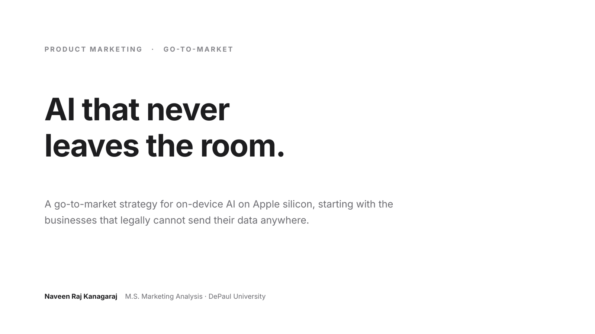
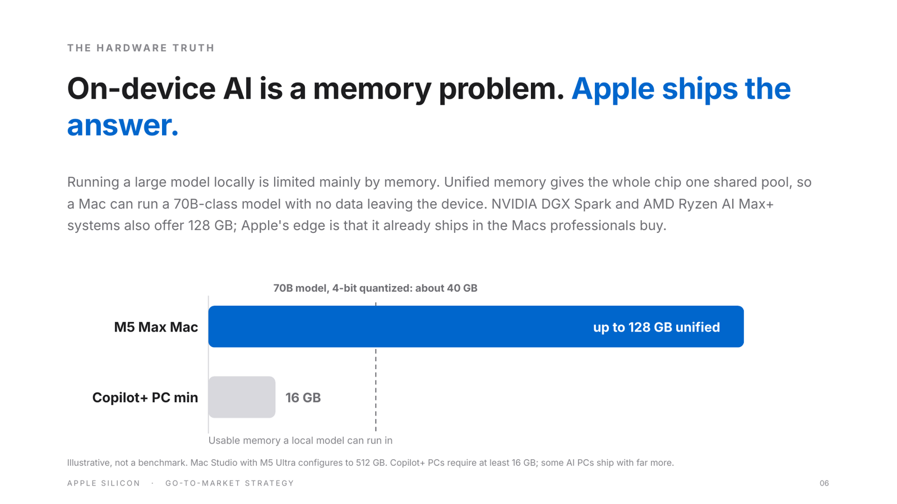
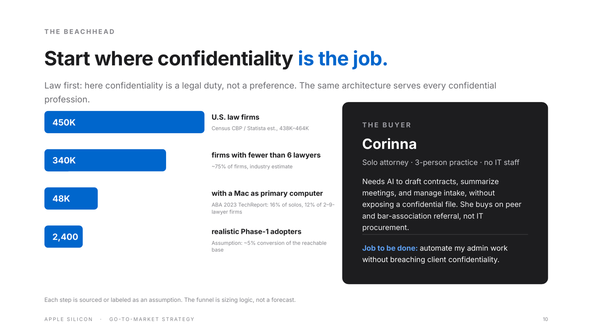
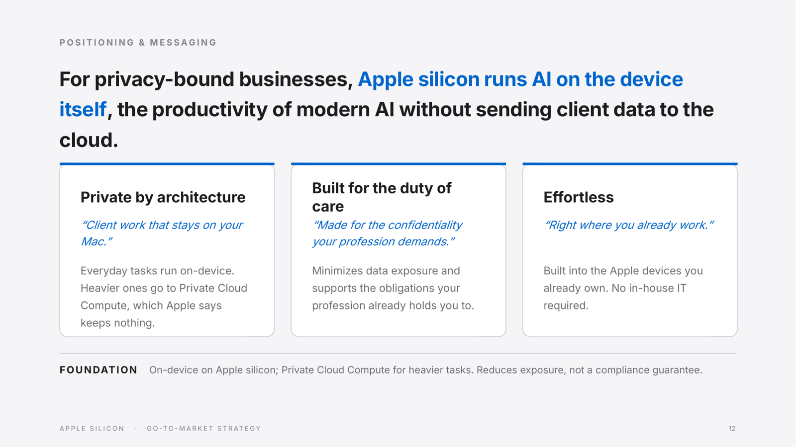

# AI That Never Leaves the Room: On-Device AI for Confidential Professional Work

A go-to-market strategy for on-device AI on Apple silicon, starting with the solo and small law firms that cannot freely send client data to the cloud. Product marketing case study by Naveen Raj Kanagaraj.

This is an independent case study. It is not affiliated with or endorsed by Apple. Product claims are based on publicly available information, market-sizing assumptions are labeled, and the recommendations are my own.

**[Read the full deck (PDF)](Apple-SMB-AI-GTM.pdf)**

## Overview

Cloud AI tools lead on capability. But lawyers, accountants, financial advisors, and clinicians work under confidentiality duties, and sending client data to a cloud chatbot is a risk they often cannot take. For this segment, the deciding question is not which AI is smartest but which AI they can trust with client data.

Apple's advantage here is architecture, not model capability. Everyday tasks run on the device, and heavier requests go to Private Cloud Compute, which Apple says does not retain data. Apple itself addressed its capability gap by partnering: its next-generation Apple Foundation Models, announced at WWDC26, are built with Google's Gemini. That makes privacy architecture, not raw capability, the ground to compete on.

**Recommendation:** position Apple silicon as the machine for confidential AI, with Apple Intelligence as the interface. Start with a beachhead of roughly 2,400 solo and small law firms, arm developers to build vertical apps on the Foundation Models and MLX frameworks, and expand into adjacent confidential professions.

## Selected slides

| | |
|---|---|
|  |  |
|  |  |

## What is inside

- **The opportunity:** why confidentiality-bound professionals are underserved by cloud-first AI, with cited adoption and risk data
- **Why now:** M5-generation Macs, Private Cloud Compute, and the WWDC26 Apple Foundation Models
- **The hardware case:** memory as the constraint for local inference, including a comparison with other 128 GB unified-memory systems
- **Beachhead sizing:** a sourced funnel from ~450K U.S. law firms to a modeled ~2,400-firm Phase-1 beachhead, with every assumption labeled
- **Buyer persona:** a solo attorney with no IT staff
- **Positioning and a three-pillar messaging framework**
- **Go-to-market:** a platform-and-developer motion rather than a vertical campaign
- **Success metrics:** a North Star with four inputs, measured through an opted-in pilot
- **Risks, falsification criteria, and what I would validate first**

## Beachhead sizing logic

| Step | Figure | Basis |
|---|---|---|
| U.S. law firms | ~450K | Industry estimates range from ~438K to ~464K (Census County Business Patterns, Statista) |
| Firms with fewer than six lawyers | ~340K | ~75% of firms, industry estimate |
| Firms with a Mac as the primary computer | ~48K | ABA 2023 TechReport: 16% of solo practitioners and 12% of 2-9 lawyer firms report Mac OS as their primary OS |
| Realistic Phase-1 adopters | ~2,400 | Assumption: ~5% conversion of the reachable base |

This is sizing logic, not a forecast. The Mac share is an attorney-level survey figure applied to firms, so treat it as an approximation.

## Sources

- [Cisco 2024 Data Privacy Benchmark Study](https://newsroom.cisco.com/c/r/newsroom/en/us/a/y2024/m01/organizations-ban-use-of-generative-ai-over-data-privacy-security-cisco-study.html): 27% of organizations had banned GenAI, at least temporarily
- [ABA 2024 Artificial Intelligence TechReport](https://www.americanbar.org/groups/law_practice/resources/tech-report/2024/2024-artificial-intelligence-techreport/): AI-based tool use of 17.7% among solo practitioners vs 47.8% at firms of 500+ lawyers
- [ABA 2023 Solo & Small Firm TechReport](https://www.americanbar.org/groups/law_practice/resources/tech-report/2023/2023-solo-and-small-firm/): primary operating system by firm size
- [ABA Formal Opinion 512 (2024)](https://www.lawnext.com/wp-content/uploads/2024/07/aba-formal-opinion-512.pdf): lawyers' duties when using generative AI
- [ABA National Lawyer Population Survey (2025)](https://www.americanbar.org/content/dam/aba/administrative/news/2025/2025-natl-lawyer-population-survey.pdf): ~1.37M U.S. lawyers
- [IBM Cost of a Data Breach Report, 2025](https://www.ibm.com/think/x-force/2025-cost-of-a-data-breach-navigating-ai): $10.22M average U.S. breach cost
- [Statista: number of U.S. law firms](https://www.statista.com/statistics/822025/us-legal-services-market-law-firms/)
- [Apple Newsroom, June 2026: next-generation Apple Intelligence](https://www.apple.com/newsroom/2026/06/apple-intelligence-brings-powerful-ai-capabilities-into-everyday-experiences/)
- [Apple Newsroom, August 2026: Mac Studio with M5 Max and M5 Ultra](https://www.apple.com/newsroom/2026/08/apple-introduces-new-mac-studio-with-m5-max-and-m5-ultra/)
- NVIDIA DGX Spark and AMD Ryzen AI Max+ public product specifications (128 GB unified memory)

Memory figures in the deck are illustrative, not benchmarks. A 70B-class model needs about 40 GB when 4-bit quantized.

## Files

- `Apple-SMB-AI-GTM.pdf`: the full deck
- `thumb-*.png`: slide previews used in this README
