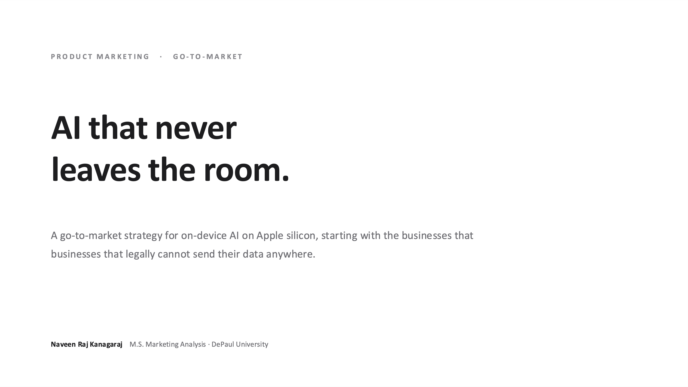
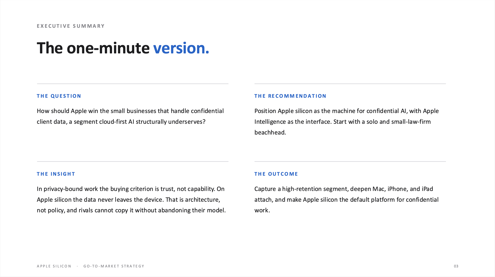
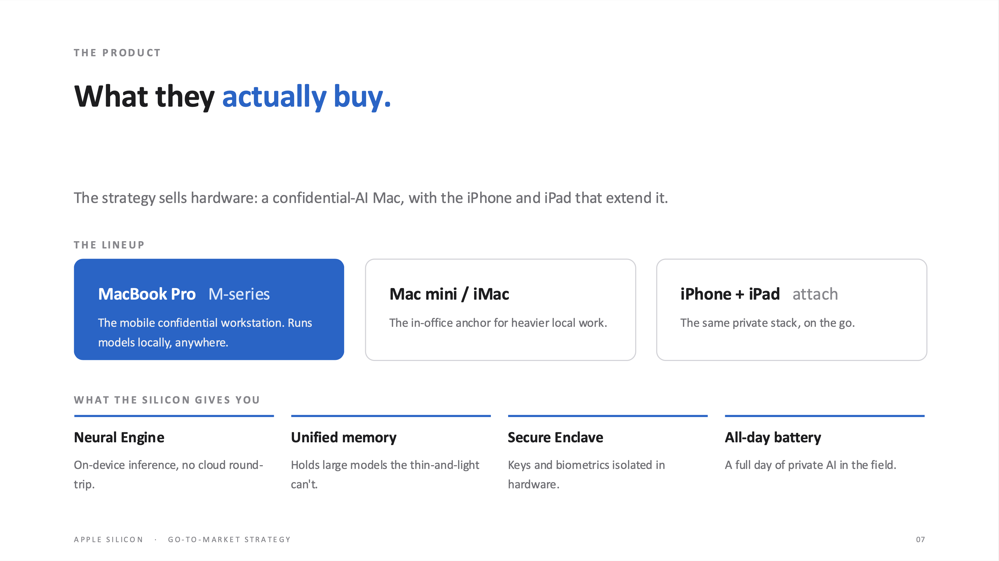
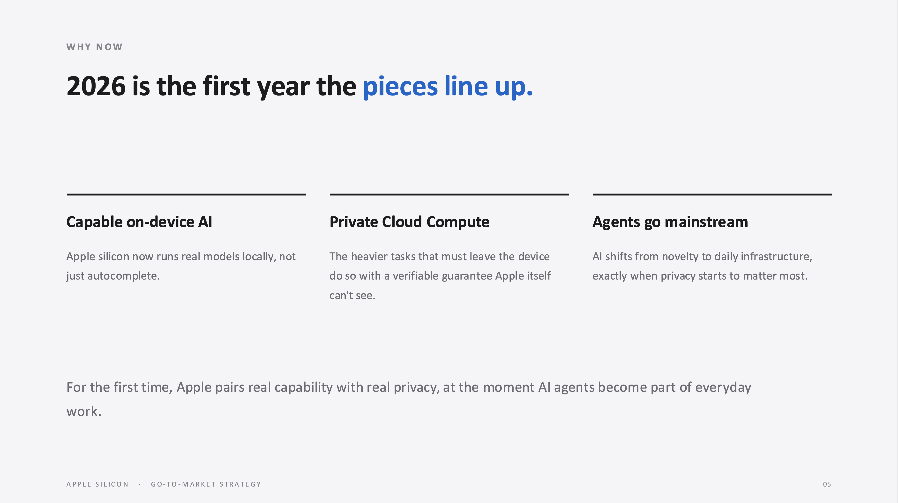

# Winning Small Business with On-Device AI

A go-to-market strategy for on-device AI on Apple silicon. Product marketing case study by Naveen Raj Kanagaraj.

This is an independent case study. It is not affiliated with or endorsed by Apple. Product claims are based on publicly available information, and the recommendations are my own.

**[Read the full deck (PDF)](Apple-SMB-AI-GTM.pdf)** 

## The argument

Cloud-first AI has won the mainstream on capability and price. But a large group of small businesses cannot use it freely. Law firms, medical practices, accounting firms, and financial advisors handle confidential client data, and putting that data into a cloud AI creates real risks around privilege, compliance, and client trust.

For these businesses the deciding question is not which AI is smartest. It is which AI they can trust with their clients' data. That is where Apple has an advantage its cloud-first rivals cannot easily copy. On Apple silicon, inference runs on the device itself: one controlled stack of chip, OS, and model keeps sensitive work local, with Private Cloud Compute reserved for heavier tasks.

The recommendation is to position Apple silicon as the machine for confidential AI, with Apple Intelligence as the interface, start with a focused beachhead of solo and small law firms, and expand into adjacent confidential fields.

## What they buy

The strategy sells hardware, not a concept: a confidential-AI Mac (MacBook Pro and Mac mini / iMac, M-series), with iPhone and iPad as the attach. On-device features map to the confidential-work job: the Neural Engine runs models locally, unified memory holds large models the thin-and-light can't, the Secure Enclave isolates keys in hardware, and all-day battery supports a mobile practice.

## What is inside

- A point-of-view opening: why Apple should compete on trust, not raw capability
- The market opportunity and the core problem, backed by cited data
- The hardware case for on-device AI, built on unified memory
- The product: the Mac lineup being sold and its feature-to-benefit story
- A competitive read framed as cloud versus on-device architecture, not a vendor teardown
- Market sizing for the law-firm beachhead, with citations at each step, and why the prize is bigger than the beachhead
- Positioning statement and a three-pillar messaging framework
- A go-to-market plan built on enabling developers, not running a campaign
- Instrumentable success metrics, honest risks with a falsification condition, and limitations with the first tests to run

## The core argument

Cloud AI competes on policy: promises about how your data is handled after it leaves your device. Apple competes on architecture. When inference runs on-device on Apple silicon, there is nothing to promise, because the data was never sent. A policy update cannot match a hardware fact. In privacy-sensitive segments, that is the difference between a claim and a guarantee.

## Why law first

Law is the beachhead, not the whole market. Confidentiality is a legal duty for attorneys, not a preference, which makes it the most acute case. The same architecture serves every confidential profession, and the deck sizes that expansion to millions of U.S. professionals across accounting, financial advisory, and health.

## A note on method

Every figure in the deck is cited. Market-sizing figures that rely on assumptions (Apple-hardware share, Phase-1 adoption) are labeled as assumptions, not claims. Unified-memory and model-size figures are illustrative and make an architectural point rather than a benchmark. The deck also states the condition under which the thesis would be wrong.

## Sources

- [Cisco 2025 Data Privacy Benchmark Study](https://newsroom.cisco.com/c/r/newsroom/en/us/a/y2025/m04/cisco-2025-data-privacy-benchmark-study-privacy-landscape-grows-increasingly-complex-in-the-age-of-ai.html)
- [U.S. SBA Office of Advocacy: AI in Business (Sept 2025)](https://advocacy.sba.gov/wp-content/uploads/2025/09/Research-Spotlight-AI-in-Business-Small-Firms-Closing-In_-092425.pdf)
- [IDC: SMB AI adoption, 2026](https://www.idc.com/resource-center/blog/from-wait-and-see-to-all-in-how-smbs-are-rewriting-their-ai-story/)
- [ABA Formal Opinion 512 (2024)](https://www.lawnext.com/wp-content/uploads/2024/07/aba-formal-opinion-512.pdf)
- [ABA National Lawyer Population Survey (2025)](https://www.americanbar.org/content/dam/aba/administrative/news/2025/2025-natl-lawyer-population-survey.pdf)
- [IBM: Cost of a Data Breach Report, 2025](https://www.ibm.com/think/x-force/2025-cost-of-a-data-breach-navigating-ai)
